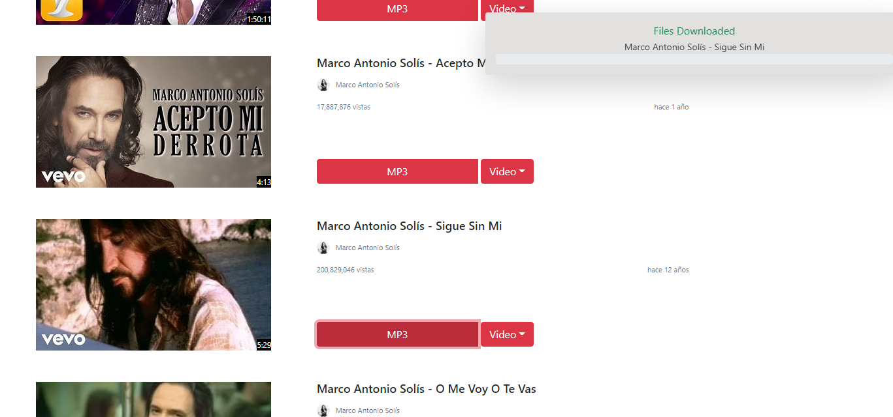
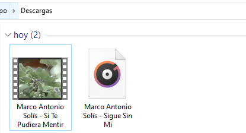

# Youtube MP3 and Video Downloader

Este proyecto se desarrollo con fines educativos basado en el lenguaje de React y Python como Backend.

## Proceso de la Instalación

In the project directory, you can run:

1. instalar las dependencias necesarias

### `npm install`

2. Una vez instaladas las dependecias asegurate de tener instalado python ya que el backend funciona con python de igual forma instalar las dependencias de python. 

`import requests as rqst`
`import numpy as np`
`from bs4 import BeautifulSoup as bs`
`import json`
`from flask import Flask, redirect, url_for,request`
`import flask`
`from flask_cors import CORS`
`from pytube import YouTube`
`import os`
`from firebase import firebase`

### una vez instalado todo ejecuta el acceso directo llamado `Youtube MP3`

**Nota: El programa es de uso publico para fines educativos no me hago responsable del mal uso del mismo...  !**

## Acerca de
El backend esta desarrollado en Python utilizando Flask para hacer scrapy web tiene algunos bugs que se estarán corrigiendo poco a poco...

### BUGS SOLUCIONADOS 

EL backend al mandar varios archivos no funcionaba las descargas correctamente se soluciono metiendo a clases la programación para que generaran nuevas instancias. 

### BUGS PENDIENTES

El front end no responde a la actualizacion de los estados correctamente se implementara Redux para facilitar el trasporte de los estados.
El backend tiene problemas al mandar muchos datoa se necesita renderizar (Solucion pendiente)

### Desarrollo

El desarrollo de este sistema se realizó por Marco Antonio Herrera Salas
desarrollado en React y Python asi mismo se utilizo una base de datos NoSQL MongoDB 

Por el cual es necesario crear una cuenta de MongoDB y realizar su conexión para que el programa funcione.

